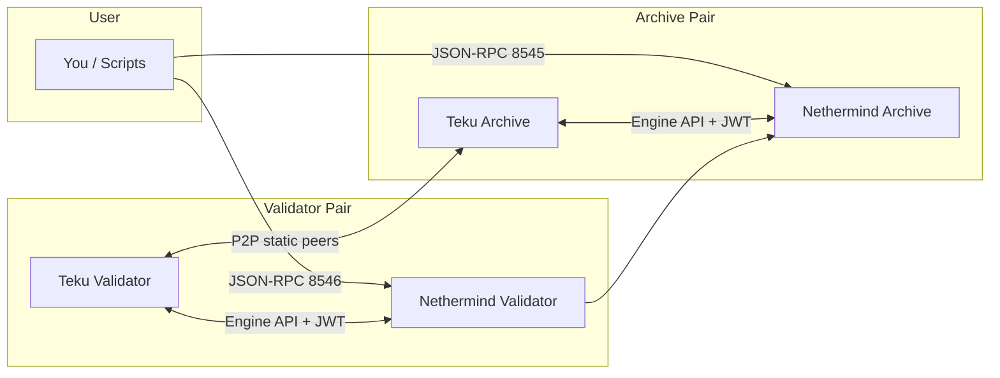

# local-ethereum-network

Local Ethereum devnet with Nethermind (EL) + Teku (CL), plus an archive node configuration.

## 🧰 Tooling
- Genesis generator: ethpandaops/ethereum-genesis-generator (EL + CL genesis)
- Validator keys: ethstaker/ethstaker-deposit-cli

## 🧭 Operational Plan & SRE Perspective

Primary deliverable:
- [Operational Plan](docs/Operational-Plan.md)

Includes:
- Production-grade archive node operational plan
- SRE perspective (SLO, error budget, paging conditions)

## 🗂️ Directory structure

- `config/`: Client configs and genesis inputs.
- `config/genesis/`: Genesis templates and `values.env` inputs.
- `config/nethermind/`: Nethermind EL configs (validator + archive).
- `config/teku/`: Teku CL configs (validator + archive).
- `docs/`: Project docs (design, requirements, tasks, overview).
- `scripts/`: Helper scripts for setup, genesis, keys, wiring, checks.
- `secrets/`: Local secrets (jwt, keys, passwords). Do not commit.
- `data/`: Runtime data directories for EL/CL containers.
- `genesis-output/`: Temporary output from genesis generator.
- `docker-compose.yml`: Local devnet definition.
- `README.md`: Primary usage guide.

## 🏗️ Architecture (local devnet)



## ✅ Prerequisites
- Docker (for genesis generation and running the local network)
- OpenSSL (for JWT secret generation)
- Foundry `cast` (optional, for test transactions)

Install `cast` (Foundry):

```sh
curl -L https://foundry.paradigm.xyz | bash
foundryup
```

## 🚀 Quick start (from scratch)

This path is fully reproducible and uses the one-shot script.

```sh
./scripts/clean-localnet.sh
./scripts/start-localnet.sh
# First run will generate validator keys and show a 24-word mnemonic.
# Paste it into config/genesis/values.env (EL_AND_CL_MNEMONIC), then:
./scripts/start-localnet.sh
# After 30-60s:
./scripts/post-start-checks.sh
# Optional: send a test transaction (requires cast)
TX_RPC_URL=http://localhost:8546 ./scripts/send-test-tx.sh
```

Notes:
- On first run, `start-localnet.sh` will create `config/genesis/values.env` and run `./scripts/generate-keys.sh`.
- It stops after key generation so you can paste the mnemonic into `values.env`, then rerun.
- It wires Teku peers automatically via `./scripts/wire-peers.sh` using `docker-compose.logs`.
- During peer wiring it also clears stale `*.lock` files in `secrets/validator-keys` and restarts Teku.
- You can tune the wait before wiring peers with `WIRE_PEERS_START_DELAY` (seconds).

## 🛠️ Setup (manual)

### 🧬 1) Configure genesis inputs

Copy and edit the generator config:

```sh
cp config/genesis/values.env.example config/genesis/values.env
```

Edit `config/genesis/values.env` and set:
- `EL_AND_CL_MNEMONIC` (24-word mnemonic)
- `NUMBER_OF_VALIDATORS` (at least 1)
- Optionally adjust `CHAIN_ID`, `GENESIS_DELAY`, and premine settings

### 🧬 2) Generate genesis artifacts

```sh
./scripts/generate-genesis.sh
```

This generates and syncs:
- `config/nethermind/chainspec.json`
- `config/nethermind/genesis.json`
- `config/teku/genesis.ssz`
- `config/teku/config.yaml`
It also patches Teku config to use a terminal block hash transition.

### 🔐 3) Generate JWT secret

```sh
./scripts/generate-jwt.sh
```

### 🔑 4) Generate validator keys

This uses the official Docker image from ethstaker-deposit-cli:

```sh
./scripts/generate-keys.sh
```

Place keystores under:
- `secrets/validator-keys/`

Place password files under:
- `secrets/validator-passwords/`

Ensure the validator count matches `NUMBER_OF_VALIDATORS` in `config/genesis/values.env`.

Optional overrides:
- `DEPOSIT_CLI_CHAIN` (default: `mainnet`)
- `DEPOSIT_CLI_LANGUAGE` (default: `english`)
- `DEPOSIT_CLI_IMAGE` (default: `ghcr.io/ethstaker/ethstaker-deposit-cli:latest`)

Copy the displayed 24-word mnemonic into `config/genesis/values.env` as `EL_AND_CL_MNEMONIC`.

Note: If the CLI doesn't write password files, create them manually using the same password:

```sh
for f in secrets/validator-keys/keystore-*.json; do
  base=$(basename "$f" .json)
  printf '%s' '<YOUR_KEYSTORE_PASSWORD>' > "secrets/validator-passwords/${base}.txt"
done
```

## ▶️ Run the local network (manual)

```sh
docker compose up
```

### 🔗 Wire CL peers (required for local discovery)

Teku nodes do not always discover each other in an isolated Docker network.
This script extracts peer IDs from logs and configures static peers.

```sh
docker compose logs teku-validator teku-archive > docker-compose.logs
WIRE_PEERS_LOG_FILE=docker-compose.logs ./scripts/wire-peers.sh
```

## ✅ Post-start checks

Run after the network has been up for ~30-60s:

```sh
./scripts/post-start-checks.sh
```

Example output:
```text
Post-start checks (RPC: http://localhost:8545)
eth_blockNumber (t0): 0x6c (108)
eth_blockNumber (t1): 0x6d (109)
OK: block number is increasing.
```

Optional overrides:
- `EL_RPC_URL` (default `http://localhost:8545`)
- `POST_CHECK_SLEEP` (seconds between block number checks, default `15`)
- `RPC_RETRIES` (default `3`)
- `RPC_RETRY_SLEEP` (default `2`)
- `RPC_TIMEOUT` (curl max time in seconds, default `3`)

## 💸 Send a test transaction (cast)

This helper derives keys from your `EL_AND_CL_MNEMONIC` and sends a small transfer.

```sh
./scripts/send-test-tx.sh
```

Example command:
```sh
TX_RPC_URL=http://localhost:8546 \
TX_FORCE_CURL=1 \
TX_DEBUG=1 \
TX_TIMEOUT=120 \
TX_RETRIES=5 \
TX_RETRY_SLEEP=5 \
TX_RECEIPT_TIMEOUT=120 \
TX_RECEIPT_POLL=2 \
TX_VALUE=2wei \
./scripts/send-test-tx.sh
```

Example output:
```text
Sending test tx:
- From index: 0 (0x10d6e7EFD2C4Ae51273DAE0ee1d6d62A631A112A)
- To index:   1 (0x8c0741E008a3DBe1A3362C29421dba7754C6F741)
- Value:      2wei
- RPC:        http://localhost:8545
- TX RPC:     http://localhost:8546
- Confirmations: 1
- Timeout:       120s
DEBUG: nonce RPC raw: {"jsonrpc":"2.0","result":"0x2","id":1}
DEBUG: tx hash: 0x48527362dfa685738a12cbeeab48658b3c20ff2d7898a821c4a1a27c6a0c3e16
From balance before: 999999999999995387849799991
From balance after:  999999999999995299818576989
To balance before:   1000000000000000000000000009
To balance after:    1000000000000000000000000011
Historical balance at block 0:
0x33b2e3c9fd0803ce8000000 (1000000000000000000000000000)
```

Overrides:
- `EL_RPC_URL` (default `http://localhost:8545`)
- `TX_RPC_URL` (default `EL_RPC_URL`; set to `http://localhost:8546` to hit the validator EL)
- `TX_VALUE` (default `1wei`)
- `MNEMONIC_INDEX_FROM` (default `0`)
- `MNEMONIC_INDEX_TO` (default `1`)
- `TX_FORCE_CURL` (set `1` to skip `cast rpc` when fetching nonce)
- `TX_DEBUG` (set `1` to print nonce RPC debug)

## 🧹 Clean environment

To reset everything generated (containers, genesis artifacts, secrets):

```sh
./scripts/clean-localnet.sh
```

## 🔍 Inspect archive queries

```sh
curl -s -X POST http://localhost:8545 \
  -H "Content-Type: application/json" \
  --data '{"jsonrpc":"2.0","id":1,"method":"eth_blockNumber","params":[]}'
```

## 🛟 Troubleshooting

### 🔗 Wire peers fails (no peer IDs found)

Make sure Teku has logged the listening line, then rerun:

```sh
docker compose logs teku-validator teku-archive > docker-compose.logs
WIRE_PEERS_LOG_FILE=docker-compose.logs ./scripts/wire-peers.sh
```

### 🔑 Teku validator fails to load keystore password

Create one password file per keystore using the same password from `generate-keys.sh`:

```sh
for f in secrets/validator-keys/keystore-*.json; do
  base=$(basename "$f" .json)
  printf '%s' '<YOUR_KEYSTORE_PASSWORD>' > "secrets/validator-passwords/${base}.txt"
done
```

### 🧱 Teku validator lock file already in use

`wire-peers.sh` clears stale `*.lock` files automatically before restart. If it still happens:

```sh
docker compose stop teku-validator
rm -f secrets/validator-keys/*.lock
docker compose start teku-validator
```

### 🧭 Teku archive error about Bellatrix/TTD

Regenerate genesis artifacts (this patches Teku config with terminal block hash):

```sh
./scripts/generate-genesis.sh
docker compose restart teku-validator teku-archive
```

### 📉 Block number not increasing

Check that EL + CL are connected and producing blocks:

```sh
docker compose logs --tail 200 teku-validator | rg "Published block|Execution Client is online"
docker compose logs --tail 200 nethermind-archive | rg "ForkChoice|Chain head"
```

## 📝 Notes
- The archive node uses Nethermind archive mode (no pruning) and exposes JSON-RPC on port 8545.
- The validator EL also exposes JSON-RPC on port 8546 for sending transactions.
- Teku uses `config/teku/config.yaml` generated by the genesis generator for a consistent CL config.
- Do not commit secrets from the `secrets/` directory.
